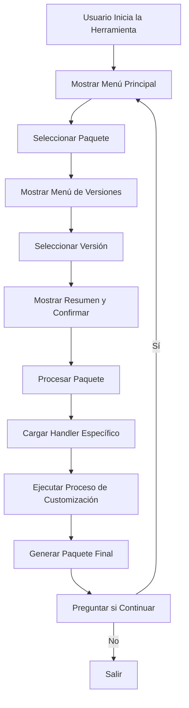
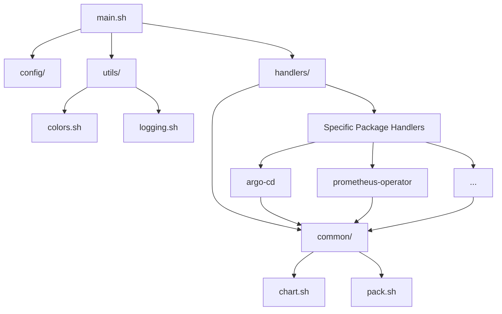

# Arquitectura del Sistema

## 📂 Estructura de Directorios

La Helm Pack Automation Tool sigue una estructura de directorios modular y organizada para facilitar su mantenimiento y extensión:

```
helm-pack-automation/
├── src/                    # Código fuente principal
│   ├── main.sh             # Punto de entrada principal
│   ├── config/             # Archivos de configuración
│   │   ├── packages.sh     # Definición de paquetes soportados
│   │   └── source.sh       # Configuración de rutas y variables globales
│   ├── handlers/           # Handlers específicos para cada paquete
│   │   ├── common/         # Funcionalidades compartidas entre handlers
│   │   │   ├── chart.sh    # Funciones comunes para manipulación de charts
│   │   │   └── pack.sh     # Funciones comunes para manipulación de paquetes
│   │   ├── argo-cd/        # Handler para Argo CD
│   │   │   ├── config/     # Configuración específica del paquete
│   │   │   ├── src/        # Código específico del paquete
│   │   │   ├── templates/  # Plantillas para personalizaciones
│   │   │   └── handler.sh  # Punto de entrada del handler
│   │   └── ...             # Otros handlers de paquetes
│   └── utils/              # Utilidades generales
│       ├── colors.sh       # Definiciones de colores para la terminal
│       └── logging.sh      # Funciones de logging
└── docs/                   # Documentación
    └── images/             # Imágenes para la documentación
```

## 🧩 Componentes Principales

### 1. Componente Principal (main.sh)

El archivo `main.sh` es el punto de entrada de la herramienta y se encarga de:

- Inicializar la configuración global
- Presentar la interfaz de usuario
- Gestionar la navegación por menús
- Coordinar el flujo de trabajo principal
- Invocar los handlers específicos según el paquete seleccionado

### 2. Sistema de Configuración (config/)

El directorio `config/` contiene los archivos de configuración:

- **packages.sh**: Define la lista de paquetes soportados, sus descripciones y configuraciones.
- **source.sh**: Establece las rutas base y variables globales del entorno.

### 3. Handlers de Paquetes (handlers/)

Cada paquete soportado tiene su propio handler en el directorio `handlers/`. Un handler típico incluye:

- **config/config.sh**: Configuración específica del paquete (repositorio, nombres, rutas).
- **src/customization_pack.sh**: Lógica para aplicar personalizaciones específicas.
- **templates/**: Plantillas y archivos de configuración adicionales.
- **handler.sh**: Punto de entrada que orquesta el proceso para ese paquete específico.

### 4. Funcionalidades Comunes (handlers/common/)

El directorio `handlers/common/` contiene funcionalidades compartidas entre diferentes handlers:

- **chart.sh**: Funciones para descargar, manipular y empaquetar charts de Helm.
- **pack.sh**: Funciones para gestionar paquetes, como copiar archivos básicos, validar versiones, etc.

### 5. Utilidades (utils/)

El directorio `utils/` contiene utilidades generales:

- **colors.sh**: Definiciones de colores para mejorar la interfaz en terminal.
- **logging.sh**: Funciones para generar mensajes de log con formato consistente.

## 🔄 Flujo de Trabajo de la Herramienta

### Flujo Principal



### Flujo de Creación de Paquete

El proceso de creación de un paquete típicamente sigue estos pasos:

1. **Inicialización**:
   - Cargar configuración del paquete
   - Verificar dependencias
   - Crear directorios temporales

2. **Descarga del Chart**:
   - Añadir/actualizar repositorio Helm
   - Descargar el chart en la versión especificada
   - Extraer metadatos (versión, app version)

3. **Validación**:
   - Verificar si ya existe un paquete con esa versión
   - Comprobar compatibilidad y requisitos

4. **Preparación**:
   - Crear estructura de directorios para el nuevo paquete
   - Copiar archivos base del paquete anterior

5. **Customización**:
   - Aplicar modificaciones específicas para Palette
   - Actualizar referencias de imágenes
   - Configurar valores por defecto
   - Añadir constraints y dependencias

6. **Empaquetado**:
   - Generar el paquete Helm final
   - Limpiar archivos temporales

## 📊 Diagrama de Dependencias



## 🔧 Diseño Modular

La Helm Pack Automation Tool está diseñada siguiendo un enfoque modular que facilita:

1. **Extensibilidad**: Añadir soporte para nuevos paquetes simplemente creando nuevos handlers.
2. **Mantenibilidad**: Aislar la lógica específica de cada paquete facilita el mantenimiento.
3. **Reutilización**: Las funcionalidades comunes se comparten entre diferentes módulos.
4. **Testabilidad**: La separación clara de responsabilidades permite tests más focalizados.

Este diseño permite que la herramienta evolucione orgánicamente, añadiendo nuevas funcionalidades sin afectar las existentes y manteniendo una base de código organizada y comprensible.

[← Volver al Índice](../README.md) | [← Anterior: Introducción](introduction.md) | [Siguiente: Requisitos e Instalación →](installation.md)
